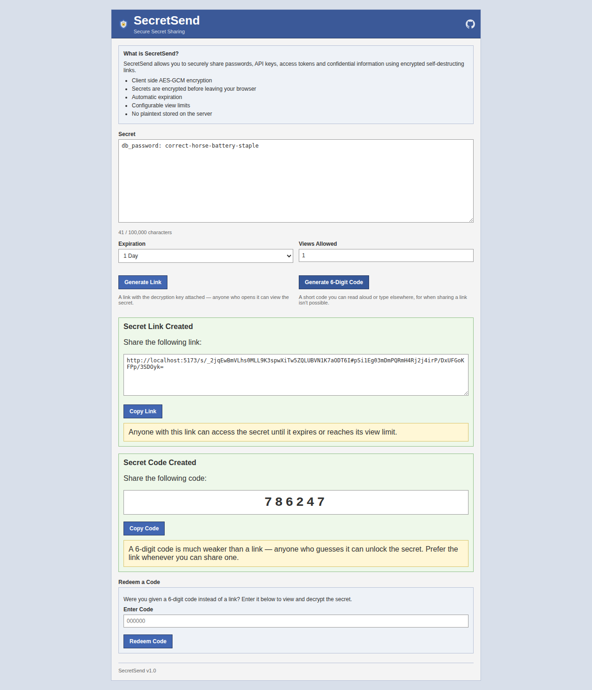
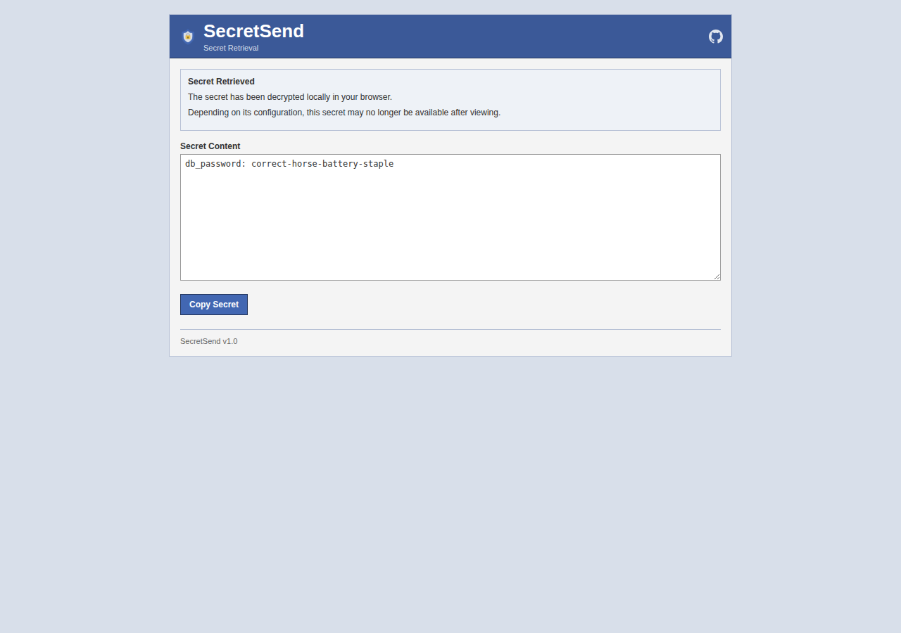
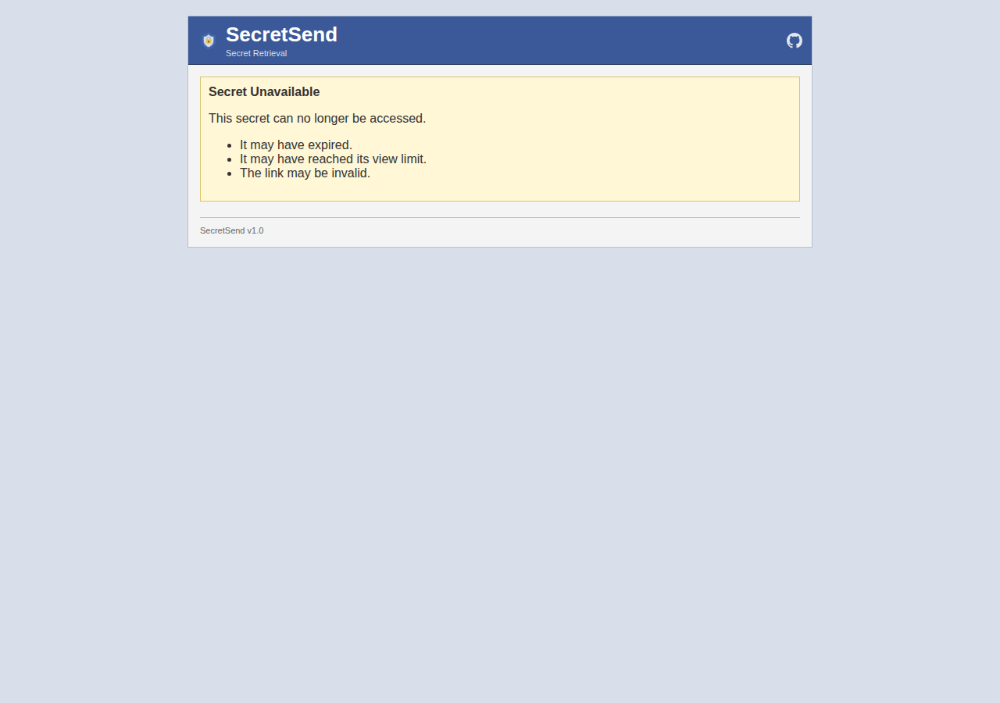
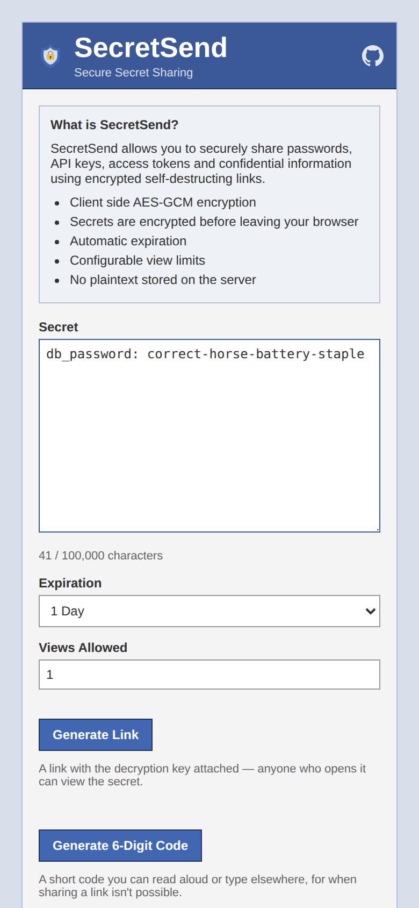

# SecretSend

<div align="center">

### Secure • End-to-End Encrypted • One-Time Secret Sharing

Share sensitive information through encrypted links that automatically expire after a configurable number of views or a specified duration.

<br>


<br>

### [🔗 Live Demo: secretsend.dev](https://secretsend.dev)

<table>
  <tr>
    <td align="center"><a href="docs/screenshots/create.png"></a><br><sub>Create</sub></td>
    <td align="center"><a href="docs/screenshots/share.png"></a><br><sub>Share link / code</sub></td>
    <td align="center"><a href="docs/screenshots/reveal.png"></a><br><sub>Reveal</sub></td>
    <td align="center"><a href="docs/screenshots/destroyed.png"></a><br><sub>Destroyed / expired</sub></td>
    <td align="center"><a href="docs/screenshots/create-mobile.png"></a><br><sub>Mobile</sub></td>
  </tr>
</table>

</div>

---

## Live Demo

[SecretSend](https://secretsend.dev/)

---

## Why SecretSend?

Traditional messaging platforms store your messages and often have access to plaintext content.

SecretSend takes a different approach:

* Encryption happens entirely in your browser.
* Decryption happens entirely in your browser.
* Encryption keys never reach the server.
* Secrets can automatically expire.
* Secrets can self-destruct after a limited number of views.
* Secrets can be shared via a link, a 6-digit code, or both.

The backend stores only encrypted ciphertext.

Even if the database is compromised, attackers cannot recover the original secret without the encryption key.

---

## Key Features

### 🔒 End-to-End Encryption

Uses AES-GCM through the browser's Web Crypto API.

### 💣 Self-Destructing Secrets

Automatically delete secrets after:

* 1 view
* Multiple views
* Configurable limits

### ⏳ Automatic Expiration

Expiration options range from 1 minute up to 1 day.

### 🔑 Client-Side Key Storage

Encryption keys are stored in the URL fragment:

```text
https://example.com/s/secret_id#encryption_key
```

URL fragments are never sent to the server.

### 🔢 Code-Based Sharing

For cases where a link can't be sent, a secret can instead be unlocked with a
server-generated 6-digit code:

* The code is generated by the server's CSPRNG — never chosen or influenced
  by the client.
* The encryption key is wrapped client-side (PBKDF2 + AES-GCM) using the
  code before it ever reaches the server.
* Redeeming a code shares the same view budget as the link, and both are
  rate-limited against guessing.
* Intentionally the weaker of the two sharing methods (a 6-digit code has
  far less entropy than the link's embedded key) — meant as a fallback,
  not a replacement for the link.

### 📱 Mobile Friendly

Responsive design supporting:

* Phones
* Tablets
* Desktops

### ⚡ Fast Retrieval

Redis provides near-instant secret access.

---

## Architecture

```text
┌───────────────┐
│     User      │
└───────┬───────┘
        │
        ▼
┌──────────────────┐
│ React Frontend   │
│ Web Crypto API   │
└───────┬──────────┘
        │
 Encrypt│Decrypt
        │
        ▼
┌──────────────────┐
│ FastAPI Backend  │
└───────┬──────────┘
        │
        ▼
┌──────────────────┐
│      Redis       │
└──────────────────┘
```

---

## Security Design

| Component        | Can See Plaintext? |
| ----------------- | ------------------ |
| Browser           | ✅ Yes              |
| FastAPI Backend   | ❌ No               |
| Redis Database    | ❌ No               |
| Backend VM Host   | ❌ No               |
| Vercel Hosting    | ❌ No               |

Additional server-side hardening: per-IP rate limiting (keyed off the raw
TCP peer address, not a client-suppliable header, so it can't be spoofed),
a locked-down CORS allowlist, a request body size cap enforced ahead of
parsing, request/TTL caps, and a Redis memory ceiling with LRU eviction so
no single client can exhaust the backend's resources.

---

## Tech Stack

### Frontend

* React
* Vite
* React Router
* Web Crypto API

### Backend

* FastAPI
* Uvicorn
* Redis

### Deployment

* Vercel (frontend, proxies API requests to the backend)
* Docker Compose (FastAPI + Redis)
* Oracle Cloud Free Tier (backend VM)

---

## Roadmap

### Completed

* End-to-end encryption
* One-time secret retrieval
* Expiration system
* View limits
* Mobile-responsive UI
* Cloud deployment
* Code-based sharing (server-generated 6-digit codes)
* Rate limiting and abuse hardening

### Planned

* Password-protected secrets
* Split-key sharing mode
* File sharing
* QR-code sharing
* Secret folders
* Access analytics
* Temporary encrypted notes
* Shamir Secret Sharing
* Progressive Web App (PWA)

---

## Learning Outcomes

This project explores:

* Applied Cryptography
* Secure Software Design
* Client-Side Encryption
* FastAPI Development
* Redis Data Management
* React Frontend Architecture
* Cloud Deployment
* End-to-End Encryption Systems

---

## Contributing

Contributions, feature requests, and bug reports are welcome.

1. Fork the repository.
2. Create a feature branch.
3. Commit your changes.
4. Open a pull request.

---

## License

MIT License

Feel free to use, modify, and learn from this project.

---

## Author

**Abdul Rafay**

CS student at ITU and AI Engineer working on AI automation, computer vision, and backend systems.

* LinkedIn: [linkedin.com/in/abdurafay19](https://www.linkedin.com/in/abdurafay19)
* GitHub: [github.com/abdurafay19](https://github.com/abdurafay19)

---

<div align="center">

Built with React, FastAPI, Redis, and curiosity.

</div>
